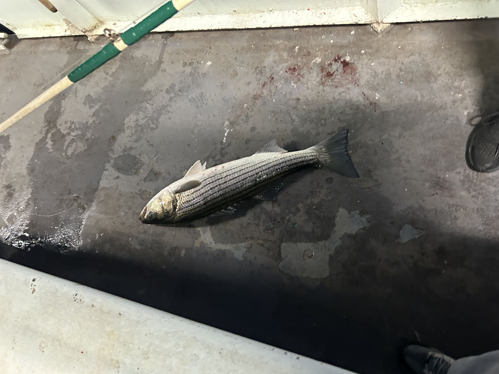
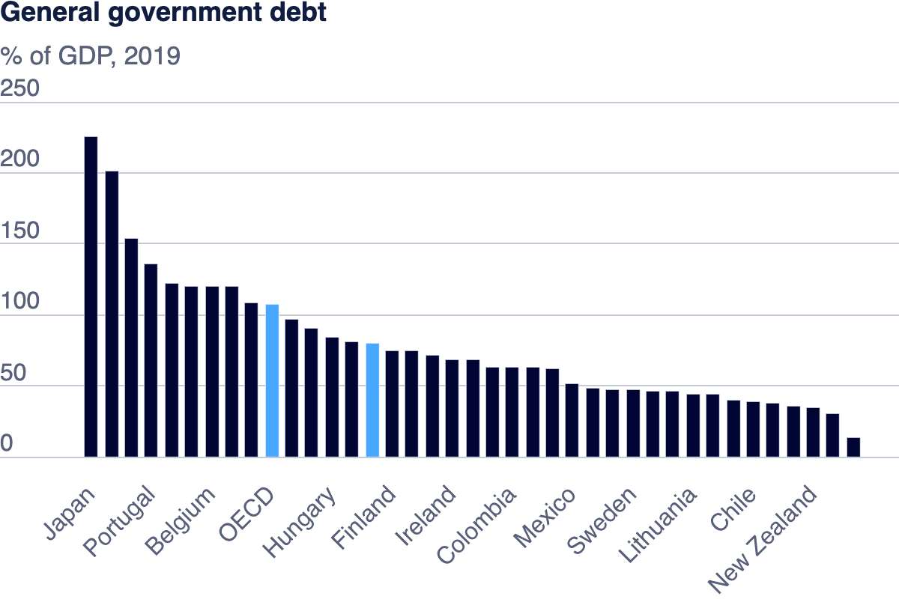

# ZhiyangProfile
This is my portfolio for Telling Story with Data at CMU.
## About Me
I am currently a master student in Carnegie Mellon University.  
I am good at **Python**, **Java**, **Machine Learning**.  
I love fishing and this is a fish I caught during fall break:  
  
If you have any question please contact me at [zhiyang3@andrew.cmu.edu](zhiyang3@andrew.cmu.edu)

## What I Hope to Learn
- **Data Visualization Techniques**  
  _To explore diverse methods that effectively convey complex information._

- **Creating Clear, Informative Charts**  
  _To design charts that are visually engaging and enhance understanding._

- **Data Storytelling**  
  _To craft narratives that highlight key insights and make data memorable._

- **Proficiency with Visualization Tools**  
  _To build expertise in tools like Tableau and Python libraries for efficient visualizations._

## Portfolio  
This section is about my future work in this course.  
- **Assignment 1: Assignment1**  
  - _Overview_: This is an image downloaded from [OECD](https://www.oecd.org/en/data/indicators/general-government-debt.html?oecdcontrol-3122613a85-var3=2019)  
  - _AssignmentLink_: [Assignment1](/Assignment1.md)  
  - _Government Debt 2019 Image_  
    
  
  
- **Assignment 3 & 4: Critique by Design with Tableau (MakeoverMonday)**  
  - _Overview_: This homework involves selecting a data visualization to critique and redesign using Tableau, following a structured process that includes critique.  
  - _AssignmentLink_(Feedback I receive): [Assignment3&4](/Assignment3&4.md)  
  - _My Visualization Link_: [Progression of Large Language Models](/LLM.md)  
  - _Original Visualization Link_: [Major Large Language Models (LLMs)  
ranked by capabilities, sized by billion parameters used for training](https://informationisbeautiful.net/visualizations/the-rise-of-generative-ai-large-language-models-llms-like-chatgpt/)
  

